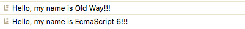
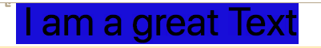
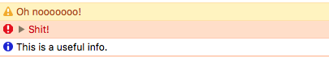
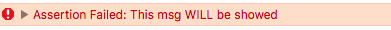
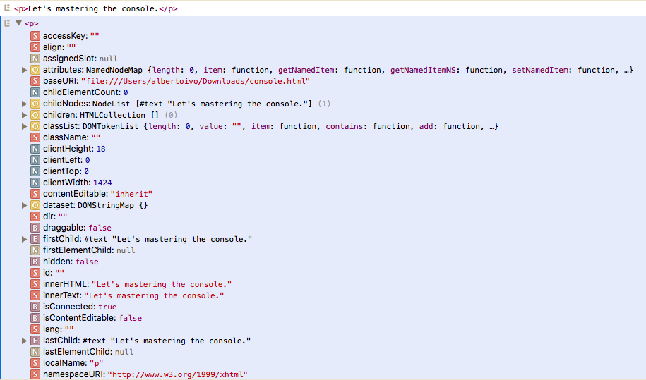
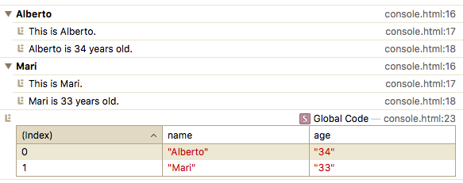
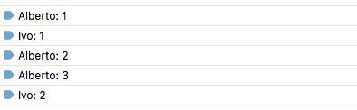
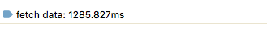

`console.xxx` is a great way to debug the code. I know that we could use a debug tool, but I prefer console. So let's see some useful hint about it.

- If you want to use the traditional `log` with variables, just use `%s` and another parameter. 

```javascript
// Interpolated
let old = 'Old Way'
let es6 = 'EcmaScript 6'

// old way
console.log('Hello, my name is %s!!!', old)

// ES6 way
console.log(`Hello, my name is ${es6}!!!`)
```
Resultado:



- You can style your message with pretty much almost all css properties, you only have to use `%c` before the sentence: 

```javascript
// Styled
console.log('%c I am a great Text', 'font-size:50px; background: blue;')
```
Resultado:



- You can write messages of `warn`, `error` and `info`:

```javascript
// Warning
console.warn('Oh nooooooo!')

// error
console.error('Shit!')

// info
console.info('This is a useful info.')
```
Resultado:



- You can display messages only if the premise is true:

```javascript
// testing
console.assert(1 === 1, 'This msg will NOT be showed')
console.assert(1 === 2, 'This msg WILL be showed')
```
Resultado:



You can `clear` the console:

```javascript
// clearing
console.clear()
```

- You can console the HTML tag exactly like it is on the html file or see it in details.

```javascript
// viewing DOM elements
<p>Let's mastering the console.</p>
const p = document.querySelector('p')

console.log(p)
console.dir(p)
```
Resultado:



- You can group an array. Assuming that the array has the same properties.  To group, both `group('string')` and `groupEnd('string')` must have the **same** string parameter. To see in a table, just use `table`:

```javascript
// grouping together
const people = [
	{ name: 'Alberto', age: '34'},
	{ name: 'Mari', age: '33'}
]

people.forEach(p => {
  console.group(`${p.name}`)
  console.log(`This is ${p.name}.`)
  console.log(`${p.name} is ${p.age} years old.`)
  console.groupEnd(`${p.name}`)
})

// table
console.table(people)
```
Resultado:



- To see how many times a string in logged, just `count` it:

```javascript
// counting
console.count('Alberto')
console.count('Ivo')
console.count('Alberto')
console.count('Alberto')
console.count('Ivo')
```
Resultado:



- To check the time a particular operation takes (milliseconds). `time` works the same way `group`. Both `time('string')` and `timeEnd('string')` must have the **same** string parameter:

```javascript
// timing
console.time('fetch data')
fetch('https://api.github.com/users/albertoivo')
  .then(resp => resp.json())
  .then(() => console.timeEnd('fetch data'))
```

Resultado:



And that's it! If you want more examples, just tell me.