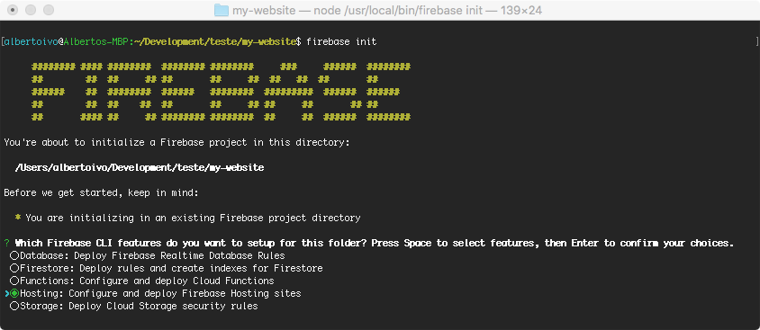

O Firebase é uma plataforma para desenvolvimento mobile e web do Google. Com ela, você pode desenvolver apps de qualidade rapidamente. Neste post, vamos focar na publicação gratuita.

* Se o projeto usa `react-router`, você deve inserir o `basename` no `<BrowserRouter>`:
```javascript
import { BrowserRouter } from 'react-router-dom'

<BrowserRouter basename={process.env.PUBLIC_URL + '/'}>
```
Mais info [aqui](https://github.com/facebook/create-react-app/issues/1765).

1. Vamos gerar uma _build_ de produção do nosso App. No terminal, vá para a raiz do projeto e rode o comando abaixo:

	`npm run build`

	Com isso, um diretório chamado **build** será criado na raiz do projeto.

2. Faça o login no [firebase](https://firebase.google.com/) com sua conta do google e dirija-se à [Console do Firebase](https://console.firebase.google.com/u/0/).

3. Lá na _Console do Firebase_, clique em **Add Project**. Aqui é preciso preencher o campo `Project Name`, _escolha um bom `id` para o seu projeto (ele fará parte da sua URL, a não ser que use um custom domain)_. Aceite os termos de uso e então **Create project**.

4. Vamos agora instalar o `Firebase` de forma global: _(Obs.: Para fazer isso recomendo fortemente uma versão LTS do node, no momento que escrevi este artigo estava em 10.13.0. Não use a versão instável mais nova)_

    `npm install -g firebase-tools`

5. Com o `Firebase` instalado, vamos fazer o login:

    `firebase login`
    
    Ao fazer isso, o firebase vai perguntar, na console, se pode coletar informações anônimas. Depois vai abrir o browser para que você logue com sua conta do google, a mesma que usou no Passo 2. E também vai pedir permissão para o Firebase CLI usar sua Google Account, obviamente você deve permitir.

6. Aqui você já deve estar logado no firebase com sucesso. Vamos inicializar o Firebase:

	`firebase init`
	
	Você verá a tela abaixo no seu terminal, usando as setinhas do teclado, escolha `Hosting` com a tecla `espaço` e então dê `enter`.

	

7. Agora terá uma nova pergunta:

    `Select a default Firebase project for this directory:`
    
    De novo, com a setinha do seu teclado, escolha o projeto criado no Passo 3 teclando `espaço` e depois `enter`.

8. Muita atenção nos passos seguintes. Você será perguntado:

    `What do you want to use as your public directory? (public)`.
    
    Sua resposta deve ser o nome do diretório criado no Passo 1: `build`.

9. Logo depois vem duas perguntas:

    `Configure as a single-page app (rewrite all urls to /index.html)? (y/N)`
    
    e
    
    `File build/index.html already exists. Overwrite? (y/N)`
    
    Para ambas, a resposta é **N**. Você **NÃO** deve sobreescrever sua pasta `build` nem  `index.html` de jeito nenhum.

10. Com isso, o firebase acaba de gerar dois arquivos no seu projeto: `firebase.json` e `.firebaserc`.

11. Agora vamos fazer o _deploy_ com o comando abaixo:

    `firebase deploy`
    
    
    
Quando vir a mensagem acima. _voilà!_ Seu app estará publicado! Basta acessar a _Hosting URL_ da mensagem.
    
_Obs.: Pode ser necessário até um minuto para que o apareça o app rodando no browser, se depois desse tempo ainda não tiver aparecido, refaça o `build` (Passo 1), veja se o `firebase.json` está apontando o "public": "build" e faça um novo deploy (Passo 11)._

## Para atualizar o app em produção

1. Basta refazer a _build_ com o mesmo comando do Passo 3:

	`npm run build`

2. E fazer o deploy com o mesmo comando do Passo 11:

	`firebase deploy`

 Pronto! Seu app está atualizado em produção!
