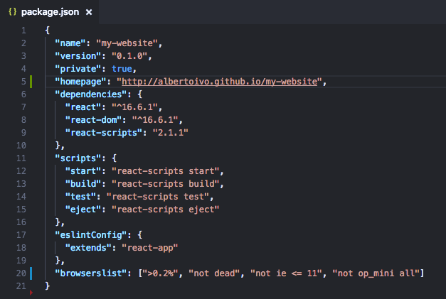
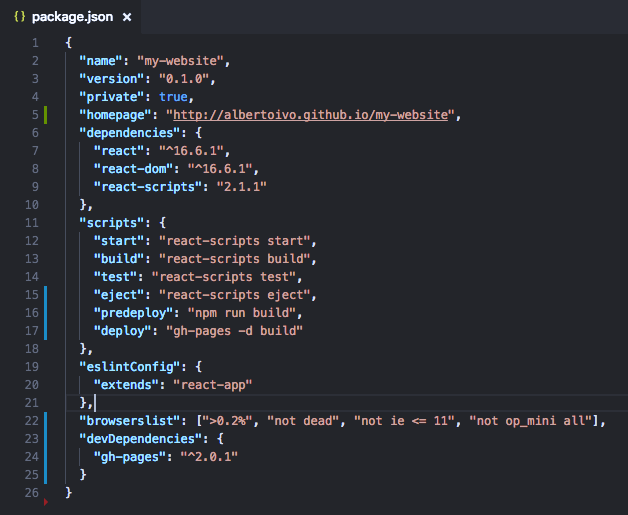

O GitHub é uma ótima ferramenta não só para repositório de código mas também para publicar nossos apps/websites. Veja como é fácil publicar lá.

### Do passo 1 ao 6 é para publicar pela primeira vez

1. Para começar, o projeto tem que estar em um repositório do GitHub (óbvio).

2. Agora, vamos gerar uma _build_ de produção. No terminal, vá para a raiz do projeto e rode o comando abaixo:

	`npm run build`

	Com isso, um diretório chamado **build** será criado na raiz do projeto.

3. Agora, copie a linha de código abaixo e cole no seu arquivo `package.json`:

	`"homepage": "http://username.github.io/meu-repositorio"`

	Substitua `username` e `meu-repositorio` acima pelo seu username e repositório no GitHub.

	

4. Ainda no `package.json` adicione as duas linhas de código abaixo na seção `scripts`:

	`"predeploy": "npm run build",`

	`"deploy": "gh-pages -d build"`

5. No terminal e na raiz do projeto, rode o comando abaixo:

	`npm install --save-dev gh-pages`

	O comando acima vai adicionar as seguintes linhas no seu `package.json`:

	```json
	"devDependencies": {
		"gh-pages": "^2.0.1"
	}
	```

	

6. E, por último, vamos publicar nosso app com o seguinte comando:

	`npm run deploy`

7. Pronto! Seu app está publicado! Basta acessar a URL que informou em `homepage` no Passo 3.

## Para atualizar o app em produção

1. Basta refazer a _build_ com o mesmo comando do Passo 2:

	`npm run build`

2. E fazer o deploy com o mesmo comando do Passo 6:

	`npm run deploy`

3. Pronto! Seu app está atualizado em produção!