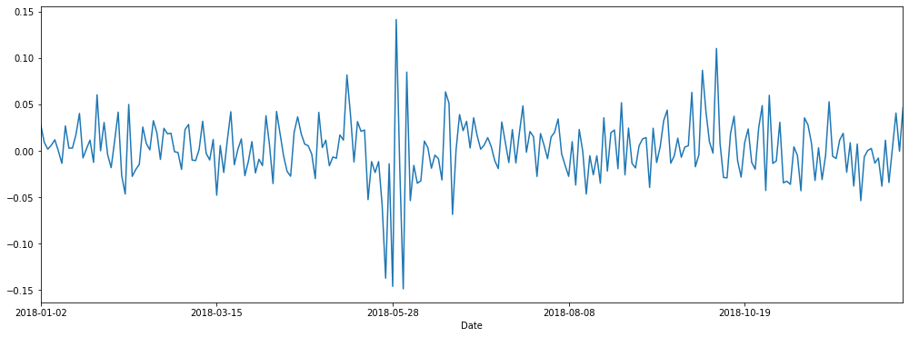

**Pandas** é uma biblioteca open source, licenciada pelo BSD, que fornece estruturas de dados de alto desempenho, fáceis de usar e ferramentas de análise de dados para a linguagem de programação Python.

Se você é programador e gosta da área financeira ou é da área financeira e gosta de programar, é essencial conhecer a linguagem de programação Python junto com a biblioteca Pandas.

Quando vamos analisar ações da bolsa de valores, nós pegamos através de uma API externa que nos retorna todos os valores de uma ação em um determinado período na forma de um objeto do Pandas chamado [Dataframe](https://pandas.pydata.org/pandas-docs/stable/reference/frame.html).

De acordo com a documentação oficial, um **Dataframe** é:

>  Estrutura de dados tabulares bidimensionais mutáveis, potencialmente heterogêneos, com eixos rotulados (linhas e colunas).

O Dataframe possui diversas funções para ser manipulado. Vamos ver algumas delas aqui.

Vamos começar importando o Pandas e chamá-lo de `pd`.

```python
import pandas as pd
```

Agora vamos ler o [CSV](../../../csv/petrobras.csv) com os valores das ações preferenciais da Petrobras (PETR4) do ano de 2018:

```python
# Uma das colunas desse CSV é o `Date`.
# Vamos setar essa coluna como o índice do dataframe com o parâmetro `index_col`.

petrobras = pd.read_csv('petrobras.csv', index_col='Date')
```

O `read_csv` lê um CSV e retorna um Dataframe com todos os valores. Para confirmar o tipo do objeto:

```python
type(petrobras)
pandas.core.frame.DataFrame
```

Para lermos as 5 primeiras linhas do nosso dataframe, usamos o método `head()`. Se quisermos ler um número de linhas diferente de 5, basta passar por parâmetro o número desejado.

```python
petrobras.head()
# petrobras.head(3)
# petrobras.head(10)
```

|Date|High|Low|Open|Close|Volume|Adj Close|Retorno Diário|
|----|----|---|----|-----|------|---------|--------------|
|2018-01-02|16.549999|16.190001|16.190001|16.549999|33461800.0|15.793664|0.027950|
|2018-01-03|16.719999|16.370001|16.490000|16.700001|55940900.0|15.936812|0.009064|
|2018-01-04|16.959999|16.620001|16.780001|16.730000|37064900.0|15.965438|0.001796|
|2018-01-05|16.860001|16.570000|16.700001|16.830000|26958200.0|16.060867|0.005977|
|2018-01-08|17.030001|16.709999|16.740000|17.030001|28400000.0|16.251730|0.011884|

Já para lermos as últimas 5 linhas do dataframe, temos o `tail()`. Aqui também podemos passar por parâmetro o número de linhas desejado.

```python
petrobras.tail()
# petrobras.tail(2)
# petrobras.tail(11)
```

|Date|High|Low|Open|Close|Volume|Adj Close|Retorno Diário|
|----|----|---|----|-----|------|---------|--------------|
|2018-12-20|22.32|21.350000|22.309999|21.490000|141767000.0|20.682493|-0.034157|
|2018-12-21|21.98|21.250000|21.400000|21.549999|90384300.0|20.740236|0.002792|
|2018-12-26|21.68|20.420000|20.590000|21.680000|77104200.0|21.583012|0.040635|
|2018-12-27|21.98|21.280001|21.520000|21.670000|74083700.0|21.573057|-0.000461|
|2018-12-28|22.83|22.080000|22.110001|22.680000|61634700.0|22.578539|0.046608|

Para ver todos os índices do dataframe:

```python
petrobras.index

    Index(['2018-01-02', '2018-01-03', '2018-01-04', '2018-01-05', '2018-01-08',
           '2018-01-09', '2018-01-10', '2018-01-11', '2018-01-12', '2018-01-15',
           ...
           '2018-12-13', '2018-12-14', '2018-12-17', '2018-12-18', '2018-12-19',
           '2018-12-20', '2018-12-21', '2018-12-26', '2018-12-27', '2018-12-28'],
          dtype='object', name='Date', length=246)
```

E se quisermos ver o cabeçalho (ou o nome das colunas) do nosso dataframe:

```python
petrobras.columns

    Index(['High', 'Low', 'Open', 'Close', 'Volume', 'Adj Close',
           'Retorno Diário'],
          dtype='object')
```

Para calcularmos dados estatísticos como [média](https://albertoivo.github.io/medidas-de-centro/), [desvio padrão (std)](https://albertoivo.github.io/medidas-de-dispersao/) e [amplitude interquartil](https://albertoivo.github.io/interquartil/) de cada coluna do dataframe:

```python
petrobras.describe()
```

||High|Low|Open|Close|Volume|Adj Close|Retorno Diário|
|-----|---|----|-----|------|---------|--------------|
|count|246.000000|246.000000|246.000000|246.000000|2.460000e+02|246.000000|246.000000|
|mean|21.393821|20.651748|21.037520|21.000081|6.684552e+07|20.103414|0.002116|
|std|3.266526|3.172321|3.234649|3.205470|3.198269e+07|3.091664|0.033054|
|min|14.890000|14.170000|14.260000|14.500000|0.000000e+00|13.865026|-0.148577|
|25%|19.129999|18.405000|18.682500|18.719999|4.598482e+07|17.935410|-0.014510|
|50%|21.215000|20.520000|20.700001|20.709999|6.020400e+07|19.777866|0.002385|
|75%|23.165000|22.652500|23.005000|22.900000|7.806155e+07|21.988045|0.019487|
|max|28.330000|27.410000|28.260000|28.160000|2.403438e+08|26.994181|0.141336|

Para ordenarmos o dataframe por uma coluna específica, temos o método `sort_values` e nele passamos por parêmetro `by` o nome da coluna que desejamos ordenar.

```python
petrobras.sort_values(by='Retorno Diário')
```

|Date|High|Low|Open|Close|Volume|Adj Close|Retorno Diário|
|----|----|---|----|-----|------|---------|--------------|
|2018-06-01|19.750000|14.900000|19.559999|16.160000|216954700.0|15.452330|-0.148577|
|2018-05-28|19.200001|16.910000|19.200001|16.910000|134504900.0|16.169487|-0.145960|
|2018-05-24|20.750000|19.650000|20.049999|20.080000|240343800.0|19.200668|-0.137086|
|...|...|...|...|...|...|...|...|
|2018-10-02|22.820000|21.900000|22.000000|22.820000|127231800.0|21.875259|0.086667|
|2018-10-08|26.969999|25.750000|26.940001|26.600000|188109000.0|25.498768|0.110184|
|2018-05-29|19.440001|17.600000|18.000000|19.299999|181509800.0|18.454824|0.141336|

Se quisermos apenas uma coluna do Dataframe:

```python
petrobras['Adj Close']

    Date
    2018-01-02    15.793664
    2018-01-03    15.936812
    2018-01-04    15.965438
    ...           ...    
    2018-12-26    21.583012
    2018-12-27    21.573057
    2018-12-28    22.578539
    Name: Adj Close, Length: 246, dtype: float64
```

Para trazer apenas algumas linhas no meio do dataframe, é só escrever o intervalo de linhas que precisa.

Por exemplo, para retornar da décima primeira até a décima quinta linha, basta fazer [10:15].

Lembrando que o número à esquerda dos _dois pontos_ é _zero-based_, por isso 10 é a décima primeira linha. Mas o número à direita é _one-based_, ou seja, a contagem começa do 1. Então 15 é 15 mesmo. =D

```python
petrobras[10:15]
```

|Date|High|Low|Open|Close|Volume|Adj Close|Retorno Diário|
|----|----|---|----|-----|------|---------|--------------|
|2018-01-16|17.840000|17.299999|17.350000|17.650000|58618300.0|16.843393|0.017291|
|2018-01-17|18.360001|17.809999|17.920000|18.360001|58488900.0|17.520950|0.040227|
|2018-01-18|18.530001|17.930000|18.350000|18.219999|48575800.0|17.387346|-0.007625|
|2018-01-19|18.420000|18.030001|18.309999|18.260000|33470200.0|17.425518|0.002195|
|2018-01-22|18.469999|18.090000|18.260000|18.469999|33920000.0|17.625917|0.011500|

Mas se quisermos ver as linhas através do índice, que é uma data:

```python
petrobras['2018-10-01':'2018-10-05']
```

|Date|High|Low|Open|Close|Volume|Adj Close|Retorno Diário|
|----|----|---|----|-----|------|---------|--------------|
|2018-10-01|21.360001|20.799999|21.250000|21.000000|56540400.0|20.130608|-0.004267|
|2018-10-02|22.820000|21.900000|22.000000|22.820000|127231800.0|21.875259|0.086667|
|2018-10-03|25.420000|23.459999|25.250000|23.790001|152189200.0|22.805101|0.042507|
|2018-10-04|24.520000|23.209999|23.450001|24.020000|99743300.0|23.025579|0.009668|
|2018-10-05|24.590000|23.660000|24.490000|23.959999|104693400.0|22.968063|-0.002498|

E para ver apenas algumas colunas de algumas datas, usamos o método `loc`.

```python
petrobras.loc['2018-03-01':'2018-03-10', ['Volume', 'Adj Close']]
```

|Date|Volume|Adj Close|
|----|------|---------|
|2018-03-01|66380900.0|20.068930|
|2018-03-02|52682900.0|20.526993|
|2018-03-05|54242600.0|21.109116|
|2018-03-06|57240800.0|20.899170|
|2018-03-07|50956600.0|20.679682|
|2018-03-08|36156800.0|20.708311|
|2018-03-09|45560000.0|21.366777|

Para fazer a mesma coisa que acima, mas ao invés de passar o índice propriamente dito e os nomes das colunas, passarmos o número da linha e da coluna, usamos o método `iloc`.

```python
petrobras.iloc[55:60, 0:2]
```

|Date|High|Low|
|----|----|---|
|2018-03-22|22.040001|21.580000|
|2018-03-23|22.110001|21.530001|
|2018-03-26|22.200001|21.840000|
|2018-03-27|22.180000|21.370001|
|2018-03-28|21.410000|20.990000|

Também podemos fazer condições.

Por exemplo, quero ver todos os dias que houve uma alta maior que 10%:

```python
petrobras[petrobras['Retorno Diário'] > 0.1]
```

|Date|High|Low|Open|Close|Volume|Adj Close|Retorno Diário|
|----|----|---|----|-----|------|---------|--------------|
|2018-05-29|19.440001|17.60|18.000000|19.299999|181509800.0|18.454824|0.141336|
|2018-10-08|26.969999|25.75|26.940001|26.600000|188109000.0|25.498768|0.110184|

Ou uma queda maior 10%

```python
petrobras[petrobras['Retorno Diário'] < -0.1]
```

|Date|High|Low|Open|Close|Volume|Adj Close|Retorno Diário|
|----|----|---|----|-----|------|---------|--------------|
|2018-05-24|20.750000|19.65|20.049999|20.08|240343800.0|19.200668|-0.137086|
|2018-05-28|19.200001|16.91|19.200001|16.91|134504900.0|16.169487|-0.145960|
|2018-06-01|19.750000|14.90|19.559999|16.16|216954700.0|15.452330|-0.148577|

Para ver qual foi a média de retorno diário que essa ação teve:

```python
media_diaria = petrobras['Retorno Diário'].mean()
print('{}%'.format(round(media_diaria * 100, 3)))

0.212%
```

E o desvio padrão (_std - standard deviation_).

Obs.: o desvio padrão mede a volatilidade dos preços da ação. Quanto maior esse valor, mais volátil ela é.

```python
petrobras['Retorno Diário'].std()

0.0330541216641421
```

E para plotar um gráfico de uma determinada coluna, é tão simples quanto ver a média ou o desvio padrão.

Obs.: Abaixo eu passei mais um parâmetro que é o tamanho do gráfico: `figsize=()`.

```python
petrobras['Retorno Diário'].plot(figsize=(17,6))
```

