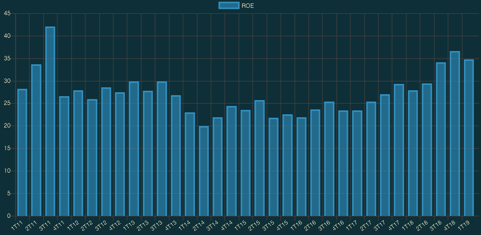
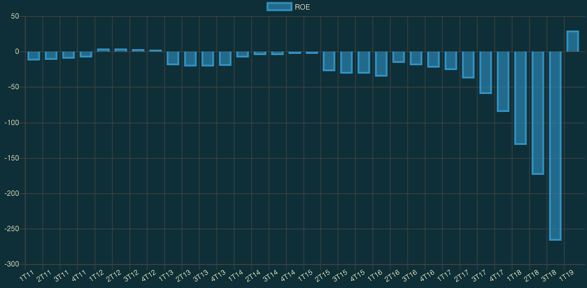

**Retorno sobre o patrimônio líquido (_Return on Equity – ROE_)** é uma medida de desempenho financeiro calculada dividindo-se o lucro líquido pelo patrimônio líquido. Como o patrimônio líquido é igual aos ativos de uma empresa menos sua dívida, o ROE poderia ser considerado como o retorno sobre os ativos líquidos.

Também é considerado uma medida de como a administração está efetivamente usando os ativos da empresa para gerar lucros. Em outras palavras, mede a **lucratividade** de uma empresa em relação ao patrimônio dos acionistas.

Quanto maior o ROE, mais eficiente a gestão de uma empresa para gerar renda e crescimento a partir de seu financiamento de capital.

O ROE é frequentemente usado para comparar uma empresa com seus concorrentes e o mercado em geral. A fórmula é especialmente benéfica quando se comparam empresas do mesmo setor, uma vez que tende a fornecer indicações precisas de quais empresas estão operando com maior eficiência financeira e para a avaliação de praticamente qualquer empresa com ativos tangíveis.

### Como calcular

`ROE = Lucro Líquido / Patrimônio Líquido`

Alguns sites, como o [Fundamentus](http://www.fundamentus.com.br/), já informam o **ROE** das empresas, o que facilita bastante para quem não quer ler o relatório contábil de todas empresas de um determinado setor e pegar as informações necessárias de cada um delas para realizar o cálculo acima.

### Quando calcular

O ROE pode ser calculado em diferentes períodos para comparar sua alteração no valor ao longo do tempo. Ao comparar a mudança na taxa de crescimento do ROE de ano para ano ou de trimestre para trimestre, por exemplo, os investidores podem acompanhar as mudanças no desempenho da administração.

### Como usá-lo em suas análises

Uma boa regra é olhar um ROE que seja igual ou um pouco acima da média do grupo de seus concorrentes. Por exemplo, suponha que uma empresa, a Nossas Rotas, tenha mantido um ROE estável de 18% nos últimos anos enquanto a média de seus concorrentes foi de 15%. O investidor pode concluir que a administração da Nossas Rotas está acima da média no uso dos ativos da empresa para gerar lucros.

O ROE pode variar significativamente de um setor para o outro. Portanto sempre compare o ROE de uma empresa com seus concorrentes diretos.

### Cuidados

É normal um ROE de uma empresa ficar bem mais alto que a média em um determinado período. Portanto muito cuidado ao olhar apenas o último número. O ideal seria olhar o ROE dos últimos 3 a 5 anos para saber se a empresa mantém uma estabilidade nessa taxa.

### Exemplos práticos com dados reais

No exemplo abaixo, analisaremos duas empresa: **Engie Brasil (EGIE3)** e **Banco Indusval (IDVL4)**. São setores totalmente diferentes, a idéia aqui não é analisar a melhor empresa de um determinado setor e sim mostrar porque não olhar apenas para o ROE do último ano.

- **EGIE3**: podemos ver que, na média anual (de 2011 a 2019), ela sempre se manteve acima dos 22%. Logo, há uma forte indicação de que é uma empresa estável por manter uma boa regularidade neste indicador.

- **IDVL4**: podemos ver que desde de 2011 está negativo e só no primeiro trimestre de 2019 é que ficou positivo. Se olhássemos apenas para o dado mais atual (até a data que escrevi esse post), seríamos enganado achando que ela tem um ROE positivo.

### Conclusão

No exemplo acima, vemos que a Engie Brasil costuma ser mais eficiente que o Banco Indusval. Mas isso não quer dizer que, necessariamente, uma é melhor que a outra. O ROE deveria ter um peso grande na escolha de uma ação, mas nunca ser o único dado a ser olhado.

Um bom lugar para ver o gráfico desses indicadores é o site do [Pense Rico](https://vicenteguimaraes.penserico.com/).

> Nenhum Indicador Fundamentalista deve ser analisado individualmente. Antes de decidir qual a empresa deseja ser sócio, estude vários indicadores assim como o balanço patrimonial e os resultados da empresa. 