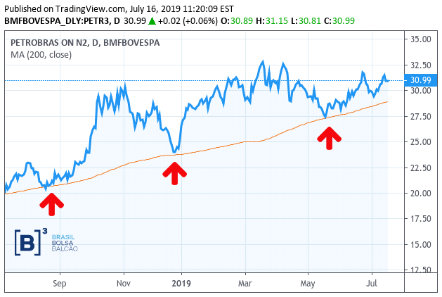
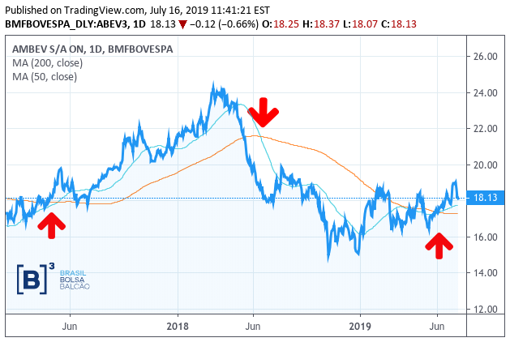

**Média Móvel (MA - _Moving Average_)** é um indicador amplamente utilizado na análise técnica que ajuda a suavizar o preço da ação, filtrando o “ruído” das flutuações aleatórias de preços de curto prazo. É um indicador de seguimento de tendência, ou atraso, porque se baseia em preços passados.  

As duas médias móveis básicas e mais usadas são:
- **Média Móvel Simples (SMA - _Simple Moving Average_)**, que é a média simples de um ativo em um número definido de períodos de tempo
- **Média Móvel Exponencial (EMA - _Exponential Moving Average_)**, que dá maior peso aos preços mais recentes.
 
Embora as médias móveis sejam suficientemente úteis por si só, elas também formam a base para outros indicadores técnicos, como o MACD (_Moving Average Convergence Divergence_).

As médias móveis ficam aquém do preço atual porque são baseadas em preços passados; quanto maior o período de tempo para a média móvel, maior será o atraso. Assim, uma MM de 200 terá um grau de atraso muito maior do que uma MM de 20. Esses comprimentos podem ser aplicados a qualquer período de tempo do gráfico (um minuto, cinco minutos, diário, semanal etc).

O intervalo da média móvel a ser utilizado depende dos seus objetivos:
 - médias móveis mais curtas (Ex.: 9, 21 e 50) são usadas para negociações de curto prazo;
 - médias móveis maiores (Ex.: 85, 100 e 200) são mais adequadas para investidores de longo prazo.

## Como usar as Médias Móveis

### Suporte e Resistência

As aplicações mais comuns das médias móveis são identificar a direção da tendência e determinar os níveis de suporte e resistência.

Veja o exemplo abaixo da Petrobras (PETR3) com uma MM de 200:

### Cruzamento de duas médias móveis

Outro uso bastante comum é no cruzamento de duas médias móveis, onde uma utiliza uma duração mais curta e outra mais longa.

- Quando a média **curta** cruza para **cima** a média mais **longa**, tem-se uma tendência de alta (ou uma possível indicação de **compra**).
- Assim como quando a média **curta** cruza para **baixo** a média mais **longa**, tem-se uma tendência de baixa (ou uma possível indicação de **venda**).

No exemplo abaixo, temos a AMBEV (ABEV3) com duas médias móveis: 50 (azul) e 200 (laranja). Note o momento que a MM50 cruza para cima a MM200, mostrando a tendência de alta. E lá na frente cruza para baixo, mostrando a tendência de baixa. E já no final, temos um cruzamento para cima, o que indica que estamos entrando numa tendência de alta novamente.

