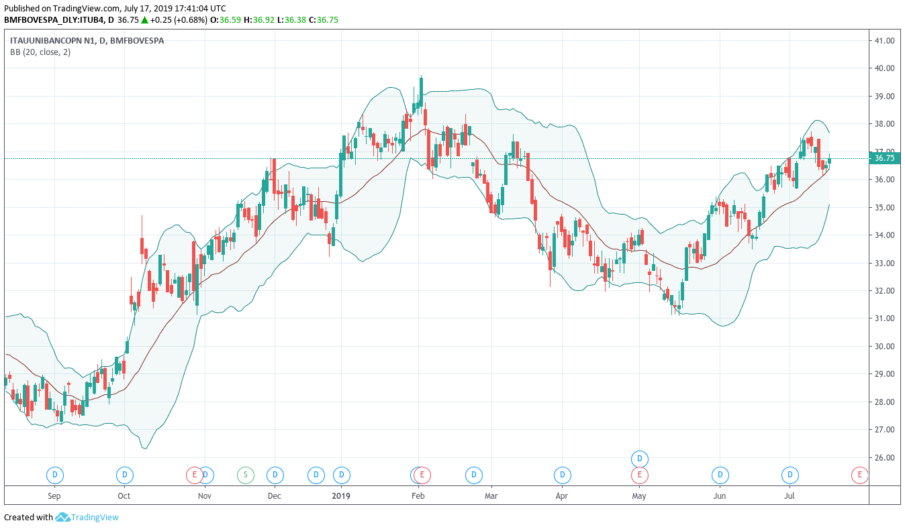

Bandas de Bollinger® consiste em uma linha central e dois canais de preços (bandas) acima e abaixo dela. A linha central é uma média móvel simples; os canais de preços são os desvios padrão da ação.

## Por que Desvio Padrão?

[Desvio Padrão]() é a medida comum da volatilidade. Em condições normais, os preços da ação ficarão entre as duas linhas de desvio padrão ou bandas. Essas bandas vão sempre expandir ou contrair de acordo com a volatilidade da ação.

## Sinais mostrados pelas Bandas de Bollinger

As Bandas de Bollinger mostram bem quando a ação está passando por um período pouco ou muito volátil.

Períodos de baixa volatilidade geralmente tendem a ser seguidos por períodos de alta volatilidade e vice-versa. Em outras palavras, se as bandas começarem a se contrair demais, há uma grande chance que a volatilidade aumente e as bandas voltem a se expandir.

Outro sinal deste indicador é quando os preços da ação vão além das bandas superior e inferior.
- Quando os preços estão **acima da linha superior**, pode ser que a ação esteja sobrecomprada e, com isso, há uma indicação de **venda**.
- Quando os preços estão **abaixo da linha inferior**, pode ser que a ação esteja sobrevendida e, com isso, há uma indicação de **compra**.

## Como calcular

As Bandas de Bollinger são formadas por três linhas:
1. A linha central é a média móvel simples (geralmente de 20 períodos).
2. As linhas superior e inferior são o desvio padrão (positivo e negativo) no mesmo período da média móvel.

## A contração

O contração (ou o estreitamento) é o conceito central das Bandas de Bollinger. Quando as bandas se aproximam, comprimindo a média móvel, isso é chamado de contração.

Essa contração sinaliza um período de baixa volatilidade e é considerado pelos investidores como um potencial sinal de aumento da volatilidade futura e de possíveis oportunidades de negociação.

Por outro lado, quanto mais distantes as bandas se movem, maior a chance de uma diminuição na volatilidade e maior a possibilidade de sair de uma negociação.

**Importante:** No entanto, essas condições não são sinais de negociação. As bandas não dão nenhuma indicação **quando** a mudança vai ocorrer ou qual direção o preço pode mover.

## Preço fora das bandas (_breakouts_)

Aproximadamente 90% do preço da ação ocorre entre as duas bandas. Chamamos de _Breakout_, quando o preço está acima da linha superior ou abaixo da linha inferior.

**Importante:** _Breakout_ não é um sinal de negociação. Eles não fornecem pistas sobre a direção ou extensão do movimento futuro dos preços.

Isso nos leva ao tópico abaixo:

## Limitações

Bandas de Bollinger não é um indicador independente. Eles são simplesmente um indicador projetado para fornecer aos _traders_ informações sobre a volatilidade dos preços.

John Bollinger sugere usá-los com dois ou três outros indicadores não correlacionados que fornecem sinais mais diretos do mercado.

Ele acredita que é crucial usar indicadores baseados em diferentes tipos de dados. Alguns recomendados são o MACD, OBV e IFR.

## Exemplo

> Existem centenas de indicadores técnicos e nenhum é garantia de sucesso. Sempre utilize mais de um indicador para basear suas operações.