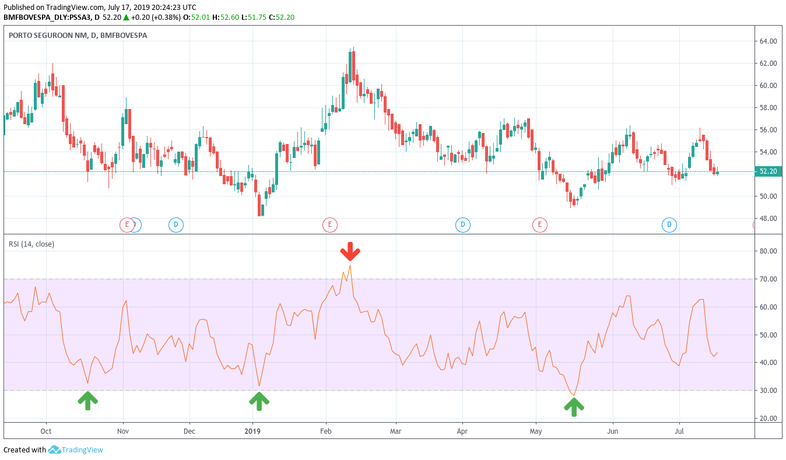

O **Índice de Força Relativa (IFR)** - ou _Relative Strength Index (RSI)_ é um indicador de momentum que mede a magnitude das mudanças recentes de preço para avaliar as condições de sobrecompra ou sobrevenda no preço de uma ação ou outro ativo.

Em outras palavras, o IFR é um indicador que compara o número de vezes que o preço da ação fechou em queda com o número de vezes que fechou em alta num determinado período de tempo (que pode ser minutos, dias, semanas, etc).

Geralmente, o IFR é calculado sobre **14 períodos de tempo**.

## Como usar

O IFR é exibido como um oscilador (um gráfico de linha que se move entre dois extremos) em um intervalo de **0 a 100**.

- `IFR > 70` - O ativo pode estar _sobrecomprado_, portanto, pode haver uma indicação de **venda**.
- `IFR < 30` - O ativo pode estar _sobrevendido_, portanto, pode haver uma indicação de **compra**.

## Exemplo

Perceba no gráfico do **Porto Seguro (PSSA3)** abaixo que quando o IFR estava por volta de 30, o preço da ação teve uma alta. Já quando o IFR ultrapassou 70, o preço da ação teve uma queda.

> Existem centenas de indicadores técnicos e nenhum é garantia de sucesso. Sempre utilize mais de um indicador para basear suas operações.