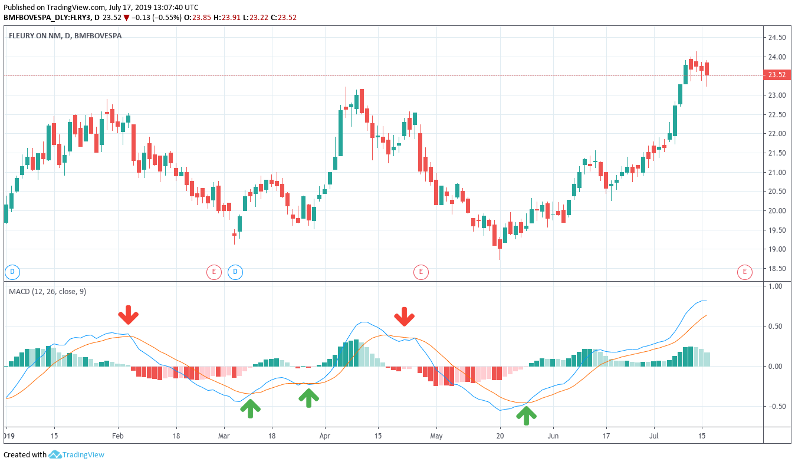

**MACD - Moving Average Convergence Divergence** é a diferença entre as [médias móveis](https://albertoivo.github.io/indicador-tecnico-media-movel/) exponenciais de **26** períodos com a de **12** períodos. O resultado deste cálculo nos dá a linha de **MACD**.

## Como usar?

É necessário criar uma outra média móvel exponencial, dessa vez de **9 períodos**, a qual chamamos de **Signal line**, para então comparar com a linha de MACD:
- Quando a linha de MACD cruza a _Signal Line_ para **cima**, há uma indicação de **compra**.
- Quando a linha de MACD cruza a _Signal Line_ para **baixo**, há uma indicação de **venda**.

Vejamos o exemplo abaixo de **Fleury (FLRY3)**. A linha de MACD está em azul. E a Signal Line é a laranja.

## Conclusão

O MACD é bem popular na análise técnica, pois dá aos investidores a capacidade de identificar rápida e facilmente a direção da tendência de curto prazo.

Esse indicador tem muitos pontos fortes, mas não é infalível. Sempre use outro indicador para confirmar os sinais produzidos pelo MACD.

> Existem centenas de indicadores técnicos e nenhum é garantia de sucesso. Sempre utilize mais de um indicador para basear suas operações.