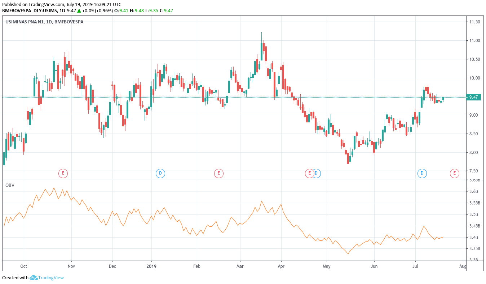

**OBV** é um indicador criado por Joseph Granville em 1963 que usa o fluxo de volume para prever mudanças no preço das ações.

Granville acreditava que o volume era a principal força por trás dos mercados e criou o OBV para projetar quando ocorressem grandes mudanças nos mercados com base nas mudanças de volume.

Ele acreditava que, quando o volume aumenta muito acima da média, sem uma mudança significativa no preço da ação, o preço acabaria subindo ou caindo.

O OBV mostra o sentimento da multidão que pode prever um resultado de alta ou de baixa.

A comparação da ação relativa entre barras de preço e OBV pode gerar mais sinais de compra e venda do que os histogramas de volume verde ou vermelho comumente encontrados na parte inferior dos gráficos de preços.

## Fórmula

- Se o preço de fechamento de hoje for maior do que o preço de fechamento de ontem, então:

`OBV atual = OBV anterior + volume de hoje`

- Se o preço de fechamento de hoje for menor do que o preço de fechamento de ontem, então:

`OBV atual = OBV anterior - volume atual`

- Se o preço de fechamento de hoje for igual ao preço de fechamento de ontem, então:

`OBV atual = OBV anterior`

## O que o OBV nos diz?

O OBV pode ser um bom indicador que nos ajuda a procurar por investidores instituiconais. Ele costuma tratar a divergência entre volume e preço na esperança de mostrar oportunidades de compra contra tendências "incorretas".

Por exemplo, investidores institucionais podem elevar o preço de um ativo aumentando sua posição de compra e, quando os investidores "menores" entrarem na onda e começarem a comprar, eles começam a vender.

> Existem centenas de indicadores técnicos e nenhum é garantia de sucesso. Sempre utilize mais de um indicador para basear suas operações.