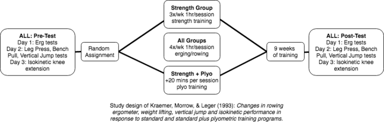

Exercícios pliométricos são usados em programas para desenvolver potência muscular. Iniciantes conseguem ganhar potência apenas com treino de força, porém atletas mais experientes podem precisar de um treino mais específico para desenvolver potência. Este post vai indicar, a partir de estudos científicos, alguns exercícios pliométricos específicos para remadores. O que fazer e o que **não** fazer.

### Sobre exercícios pliométricos

A pliometria ajuda o sistema nervoso a ativar as fibras musculares, reflexos e capacidade neuromuscular do atleta. Para remadores, ajuda na velocidade para minimizar o tempo entre remadas e potência exercida nesta remada.

A pliometria oferece uma vantagem para o desenvolvimento de potência em relação ao treinamento tradicional de força com peso livre, treinando a aceleração máxima com cargas mais leves sem (ou pouca) desaceleração.

Apesar da carga menor, a pliometria é um método de treinamento de intensidade muito alta devido ao componente de máxima aceleração e aterrissagem. Como regra geral, para os atletas pularem alto e rápido, devem saber cair bem, porque todo o poder que desenvolvem na fase concêntrica é absorvido no momento do pouso. A mecânica da aterrissagem deve ser dominada antes que os atletas possam aumentar com segurança e eficácia a variedade, o volume e a intensidade dos exercícios de salto.

> Exercícios pliométricos avançados envolvem bastante energia e potência no pouso e aceleração. Por isso, é frequentemente considerado o elo que falta entre força e alto desempenho [(Davies, Riemann, & Masnke, 2015)](https://www.ncbi.nlm.nih.gov/pmc/articles/PMC4637913/).

### O que os estudos científicos dizem sobre a pliometria no remo?

[Egan-Shuttler et al. (2017)](https://www.ncbi.nlm.nih.gov/pubmed/28150178) juntou 18 remadores (todos homens competitivos em idade colegial que nunca tiveram experiência com treino pliométrico) e dividiu em dois grupos onde o grupo 1 fez pliometria e o grupo 2 fez ciclismo. Ambos 3 vezes por semana durante 30 minutos. Nenhum grupo executou treinamento de força durante o teste.

O grupo 1 executou pulos de corda (*single* e *double-unders*), *wall ball throws*, *box jumps* e diversos outras variações de pulos. Já o grupo 2 pedalou numa bicicleta ergométrica durante o mesmo tempo sempre abaixo do limiar ventilatório. E depois fizeram o mesmo treinamento de remo.

Ao final da quarta semana, todos remaram 500 metros na máquina de remo *indoor*. O grupo 1 diminuiu o tempo de 100 para 96 segundos e uma leve melhora no pico da potência, já o grupo 2 não houve melhora significativa.

Já [Kramer, Morrow, e Leger (1993)](https://www.ncbi.nlm.nih.gov/pubmed/8300271) juntaram 28 remadoras (mulheres competitivas que já treinavam força). O programa durou 9 semanas onde, nas semanas 1-4 fizeram 4 séries de 8 repetições de *clean pull*, 6×5 de *half squat, bench pull* e *leg press* e 10×10 de *seated row*. E nas semanas de 5-9 fizeram 4×10 em todos os exercícios exceto no *seated row* que foi 5×20. O grupo de pliometria, além disso, adicionou 20 minutos de diversas variações de pulos *(bilateral jumping–squat jumps, stair jumps, hurdle jumps, and drop jumps–beginning)* de 3 a 5 séries com 10 a 20 repetições.

O teste final foi na máquina de remo *indoor* onde deveriam remar 2500 metros e depois 90 segundos onde foi medido distância e potência. E o resultado é que nenhum dos grupos teve melhoria significativa um do outro. Ambos melhoraram de forma equivalentes.

Este último estudo foi importante para uma análise sobre como **não** usar a pliometria para remadores.

### Como NÃO usar a pliometria para remadores

O estudo de [Kramer, Morrow, e Leger (1993)](https://www.ncbi.nlm.nih.gov/pubmed/8300271) nos mostrou como não usar a pliometria, vamos analisar alguns pontos:

1. A pliometria foi feita depois do treino de força com os músculos já fadigados.
2. A forma como os exercícios foram executados tiveram um foco maior em *muscular endurance* com muitas séries e repetições.
3. Como foram muitas repetições em apenas 20 minutos, não houve o descanso adequado ao músculo (menos de 1 minuto por série).

Resumindo: muitas repetições, pouco descanso e muita fadiga.

O método acima pode até servir para outros esportes, mas foi provado que não funciona para remadores que querem aumentar potência em cada remada.

O treinamento pliométrico serve para desenvolver força rápida e potência, então realizar um grande número de repetições com músculos fadigados e, com isso, diminuindo a potência de uma repetição para outra, não faz muito sentido.

Neste momento, a medida que ficamos cada vez mais cansados, os pulos ficam cada vez mais baixo, o tempo de contato com o solo entre um pulo e outro fica cada vez maior, a *wall ball* é jogada cada vez mais baixa, nós estamos treinando *muscular endurance* e não potência.

Não precisamos de pliometria para isso, ao contrário, esse tipo de treinamento pode até causar lesões, pois estamos usando movimentos bem articulados com muita força. Para isso, é mais eficiente o treinamento tradicional de força.

> *"Baixa frequência (2-3 sessões por semana) e baixo volume (3-6 séries de 2-5 repetições) são os mais apropriados. Não é necessário realizar uma infinidade de exercícios pliométricos. Tirar o máximo proveito de um programa requer dominar os movimentos dos exercícios. Para a maioria dos atletas, dois ou três exercícios pliométricos ao mesmo tempo são suficientes para atingir o domínio do movimento e obter benefícios consideráveis."* [NSCA "Developing Power"](https://www.nsca.com/education/articles/kinetic-select/plyometric-exercises/)

Treinar com menos repetições também permite que o atleta se concentre totalmente na execução com a técnica e potência adequadas. O foco mental deteriora-se em séries com muitas repetições, o que leva a um treinamento ineficaz, bem como a possíveis lesões resultantes de um lapso de foco ou falha na técnica. A execução do exercício de forma controlada, no intervalo de 2 a 10 repetições, gera um maior benefício, constrói força de maneira eficaz e reduz o risco de lesões comparados com exercícios de 20+ repetições, por exemplo.

### Exercícios sugeridos para remadores

- Level 1 (unilateral)
    - [Skipping](https://youtu.be/EdrmyU1b9IE)
    - [Skip-for-height](https://youtu.be/nRfC7pFZL64)
    - [Bounding](https://youtu.be/eIjuMzIFREs)
- Level 2 (bilateral)
    - [Countermovement Jump](https://youtu.be/RQVcG83xBxY)
    - [Dead-Start Jump](https://youtu.be/mIcFAaPin5A)
    - [Broad Jump](https://youtu.be/c6Etg7bpFfI)
    - [Dead-Start Broad Jump](https://youtu.be/X3vuhTLzE3k)
- Level 3 (throws)
    - [Overhead Throw](https://youtu.be/Pt5fFU_b_Xo)
    - [Chest Throw](https://youtu.be/R-okTT0HWVE)
    - [Rotational Throw](https://youtu.be/fi26fgPgcBg)
- Level 4
    - [UL Jump, BL Land](https://youtu.be/JTpxO789U-I)
    - [RFESS Jump](https://youtu.be/lENdxFKc1jM)
    - [Box Jump](https://youtu.be/VGi94BDfvv0)
    - [Seated Box Jump](https://youtu.be/wTgCTaLcIPc)
 
### Quando fazer o treino de pliometria e/ou força

Pesquisas sobre treinamento simultâneo indicam interferência mínima entre treino de força e aeróbico quando as sessões são **divididas por pelo menos seis horas**. Mas se você não conseguir dividir as sessões assim, pesquisas indicam que é melhor **treinar força antes do remo** (o treino de força é melhor quando feito com os músculos não-fadigados). Mais detalhes aqui: [Concurrent Training Interference Effect in Rowing](https://rowingstronger.com/2019/07/29/interference-effect-rowing/) 
